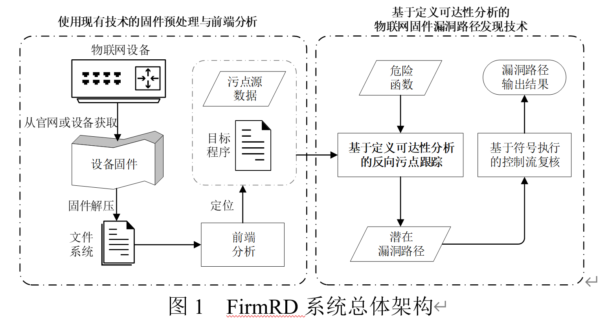

# FirmRD 
## 工具简介
该项目为第一期网络安全学院学生创新资助计划一项资助课题的开源代码，课题设计并实现了一个自动化固件漏洞挖掘系统FirmRD，通过结合基于定义可达性分析的污点分析漏洞查找以及基于符号执行的控制流复核实现了高精度的漏洞挖掘。与此同时，在漏洞漏报率方面，本课题通过识别用户输入API函数的函数调用参数特征对用户输入进行扩充，降低了漏洞漏报率，并通过识别厂商自定义库函数内漏洞的触发点进一步扩大了漏洞识别范围。经实验测试，在由来自Netgear、TP-Link、D-Link、Tenda四个厂商的49款固件组成的对比数据集中，FirmRD基于定义可达性分析的污点分析漏洞查找的漏洞识别正确率相较前沿的SaTC框架提高了1.8倍，能生成数量更多的漏洞警报，且基于符号执行的控制流复核可以在此基础上再筛除77.58%的误报数据；在由6款TOTOLINK固件组成的扩展数据集中，FirmRD以82.93%的正确率发现了68条正确漏洞警报，其中58条警报与1-day漏洞存在关联，10条是0-day漏洞警报。在整个项目过程之中，FirmRD共计发现了17个中高危漏洞，相关漏洞已提交CVE或CNVD。

针对设计并实现自动化嵌入式漏洞挖掘系统的研究目标，本课题提出的解决方案以及本课题的主体研究内容如下：
- 1.	在数据读入点定位方面，沿用2021年USENIX会议上提出的开源框架SaTC基于html、js、xml等前端文件中的关键字信息在后端文件中查找数据读入点的思路，并在工程上进行改进与完善。
- 2.	在漏洞挖掘方面，设计并实现一种基于定义可达性分析方法的物联网固件漏洞路径发现技术，实现简单、高效且精确的物联网固件漏洞挖掘。该漏洞挖掘技术主要由以下两个技术点组成：
  - 2.1. 基于定义可达性分析的污点分析漏洞查找：结合函数调用路径分析生成的启发式信息，设计了一种基于定义可达性分析方法的污点分析方法，根据参数定义情况进行了细粒度的反向污点跟踪。
  - 2.2. 基于符号执行的控制流复核：运用符号执行方法检验反向污点传播得到的潜在漏洞路径的控制流可达性，保证漏洞路径在数据流与控制流两方面都具备可达性，实现高精度的漏洞挖掘。

根据上述解决方案，本课题设计并实现了一套自动化漏洞挖掘系统FirmRD，系统整体架构如下图所示：

## 使用说明
在python3中使用pip安装angr==9.0.6885（angr不同版本间API有差距，建议不要更改版本）、requests==2.24.0、colorlog==5.0.1、six==1.15.0、python-dateutil==2.8.1、lxml==4.9.3、numpy==1.25.0以及python-dateutil==2.8.1。FirmRD对angr以外的包并无严格版本要求，它们都是SaTC前端分析模块引入的包。

`
pip3 install angr==9.0.6885 requests==2.24.0 colorlog==5.0.1 six==1.15.0 lxml==4.9.3 numpy==1.25.0 python-dateutil==2.8.1 protobuf==3.19.0`

由于FirmRD的前端分析模块是在SaTC开源框架的基础上做出改进的，需要从`https://github.com/NSSL-SJTU/SaTC`中引用satc.py、config.py和front_analysise文件夹，且需要根据报错与对应位置代码注释解除工程中部分注释信息，将前端分析模块默认python版本支持从python2修改为python3。

由于SaTC在进行前端分析时，对输出目录的获取是从该文件全局变量获取的，而FirmRD的顶层接口无法修改该全局变量，因此，在使用FirmRD前还需为satc.py中front_analysise函数添加一个参数，修改后的front_analysise函数定义如下所示：

`def front_analysise(args, front_result_output):`

最后，由于FirmRD还使用了Ghidra的交叉引用API，需要在仓库根目录下建立一个ghidra文件夹，在文件夹中放入从`https://github.com/NationalSecurityAgency/ghidra/releases`仓库下载并解压得到的Ghidra发行版代码目录，推荐使用Ghidra 10.0.4版本。
由于Ghidra的运行依赖于java，FirmRD还需要java环境的支持。从java官网`https://www.oracle.com/java/technologies/downloads/archive/`下载jdk的linux版本，docker中使用的是jdk-17_linux-x64_bin.tar.gz。下载并解压后，需要在配置文件/etc/profile的结尾部分填入以下内容，配置环境变量信息。

`#java environment
export JAVA_HOME=/home/jdk-17（填入自己的jdk解压目录）
export CLASSPATH=.:${JAVA_HOME}/jre/lib/rt.jar:${JAVA_HOME}/lib/dt.jar:${JAVA_HOME}/lib/tools.jar
export PATH=$PATH:${JAVA_HOME}/bin`

修改完毕之后，需要使用source命令使配置文件修改生效，完成后，输入java -version命令应该可以正确输出jdk版本信息。
`source /etc/profile`

仓库中提供了用于建立docker的dockerfile，由于docker镜像较大，难以上传到github，需要用户自行打包
